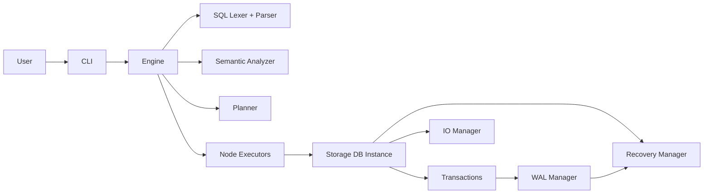

# DeltaBase

DeltaBase is a modular relational database engine written in C++20.
It includes SQL parsing, planning/execution, file-backed storage, transactions, write-ahead logging, and crash recovery.

## Highlights

- C++20 codebase split into focused modules
- SQL pipeline: lexer -> parser -> semantic analysis -> plan execution
- File-backed storage with table/page metadata
- Transaction lifecycle and WAL integration
- Recovery manager with REDO/UNDO flow and compensation records (CLR)
- CLI REPL for interactive usage
- Client integration target includes a C# ADO.NET driver for .NET applications

## Architecture At A Glance



## Modules

| Module | Responsibility | Key locations |
|---|---|---|
| `cli` | REPL loop, command parsing, formatting, meta commands | [src/cli/include/cli.hpp](src/cli/include/cli.hpp), [src/cli/cli.cpp](src/cli/cli.cpp), [src/cli/meta_executor.cpp](src/cli/meta_executor.cpp) |
| `engine` | Orchestrates query execution and DB lifecycle | [src/engine/include/engine.hpp](src/engine/include/engine.hpp), [src/engine/engine.cpp](src/engine/engine.cpp) |
| `sql` | SQL lexer and parser to AST | [src/sql/include/lexer.hpp](src/sql/include/lexer.hpp), [src/sql/include/parser.hpp](src/sql/include/parser.hpp) |
| `executor` | Semantic analysis, planning, and plan execution | [src/executor/include/semantic_analyzer.hpp](src/executor/include/semantic_analyzer.hpp), [src/executor/include/std_plan_executor.hpp](src/executor/include/std_plan_executor.hpp), [src/executor/std_plan_executor.cpp](src/executor/std_plan_executor.cpp) |
| `storage` | DB instance API, page/table/schema I/O, metadata persistence | [src/storage/include/std_db_instance.hpp](src/storage/include/std_db_instance.hpp), [src/storage/std_db_instance.cpp](src/storage/std_db_instance.cpp), [src/storage/include/io_manager.hpp](src/storage/include/io_manager.hpp) |
| `transactions` | Transaction objects and manager | [src/transactions/include/transaction.hpp](src/transactions/include/transaction.hpp), [src/transactions/include/transaction_manager.hpp](src/transactions/include/transaction_manager.hpp) |
| `wal` | WAL API, file WAL manager, serializer | [src/wal/include/wal_manager.hpp](src/wal/include/wal_manager.hpp), [src/wal/file_wal_manager.cpp](src/wal/file_wal_manager.cpp), [src/wal/std_wal_serializer.cpp](src/wal/std_wal_serializer.cpp) |
| `recovery` | Crash recovery (REDO/UNDO) over WAL | [src/recovery/include/recovery_manager.hpp](src/recovery/include/recovery_manager.hpp), [src/recovery/recovery_manager.cpp](src/recovery/recovery_manager.cpp) |
| `types` | Shared core types (AST, rows/tables, config, WAL records, UUID) | [src/types/include](src/types/include) |
| `misc` | Utility layer: logging, streams, helpers, static paths | [src/misc/include](src/misc/include) |

## Query Execution Flow

1. CLI receives command in [src/cli/cli.cpp](src/cli/cli.cpp).
2. Meta commands are handled in [src/cli/meta_executor.cpp](src/cli/meta_executor.cpp).
3. SQL commands go to `Engine::execute_query` in [src/engine/engine.cpp](src/engine/engine.cpp).
4. SQL is tokenized and parsed (`sql::lex`, `SqlParser`).
5. Semantic analysis validates query against catalog.
6. Planner builds a query plan.
7. Executor runs plan nodes and returns a materialized result.
8. Storage applies data changes, emits WAL records, and persists pages.
9. Recovery replays WAL on startup.

## Build

Requirements:

- CMake >= 3.15
- C++20 compiler
- `pkg-config`
- `libuuid` development package

Build commands:

```bash
cmake -S . -B build
cmake --build build -j
```

Produced binaries:

- `build/build/bin/main.exe`
- `build/build/bin/test.exe`

Note: CMake in this project sets runtime output under `${CMAKE_BINARY_DIR}/build/bin`.

## Run

```bash
./build/build/bin/main.exe
```

CLI meta commands:

- `.c <db_name>`: connect/attach database
- `.q`: quit

All other input is treated as SQL.

## SQL Support (Current)

The parser and execution pipeline include support for common operations such as:

- `SELECT`
- `INSERT`
- `UPDATE`
- `DELETE`
- `CREATE TABLE`
- `CREATE SCHEMA`
- `CREATE DATABASE`

See parser entry points in [src/sql/include/parser.hpp](src/sql/include/parser.hpp).

## Recovery and WAL

WAL record types are defined in [src/types/include/wal_log.hpp](src/types/include/wal_log.hpp).

Core WAL/recovery parts:

- WAL manager interface: [src/wal/include/wal_manager.hpp](src/wal/include/wal_manager.hpp)
- File WAL manager: [src/wal/file_wal_manager.cpp](src/wal/file_wal_manager.cpp)
- Recovery manager: [src/recovery/recovery_manager.cpp](src/recovery/recovery_manager.cpp)

Recovery manager currently performs:

- REDO pass for committed/eligible records
- UNDO pass for active transactions
- CLR-aware continuation in UNDO path

## Tests

```bash
./build/build/bin/test.exe
```

Test entrypoint: [tests/main.cpp](tests/main.cpp).

## Project Documentation

UML and use-case diagrams:

- [doc/class.puml](doc/class.puml)
- [doc/domain.puml](doc/domain.puml)
- [doc/use_case.puml](doc/use_case.puml)
- [doc/class.png](doc/class.png)
- [doc/domain.png](doc/domain.png)
- [doc/use_case.png](doc/use_case.png)

## Repository Layout

```text
.
├── CMakeLists.txt
├── main.cpp
├── src/
│   ├── cli/
│   ├── engine/
│   ├── executor/
│   ├── misc/
│   ├── recovery/
│   ├── sql/
│   ├── storage/
│   ├── transactions/
│   ├── types/
│   └── wal/
├── tests/
└── doc/
```

## Notes

- SELECT results are currently materialized in memory in the standard plan executor.
- Streaming execution and deeper optimization paths are still evolving.
- WAL/recovery behavior is actively evolving with recent CLR integration.
- The long-term client story includes a C# ADO.NET driver, so the protocol and result format should stay friendly to .NET consumers.
